># Optimizing Online Sports Retail Revenue
### Analyze product data for an online sports retail company to optimize revenue.

## about data  
>#### numeric, string, and timestamp data on pricing and revenue, ratings, reviews, descriptions, and website traffic.
--------------------------------------------------------------

---------------------------------------------
>## Creating and importing data 


##### FOR CREATING THE DATA BASE KINDLY USE FILE  ``` createdb.sql``` in dataset folder

-----------------

------------------------
## 1. Counting missing values
```
-- Count all columns as total_rows
-- Count the number of non-missing entries for description, listing_price, and last_visited
-- Join info, finance, and traffic
select count(i.*) as total_rows,count(i.description) as count_description ,count(f.listing_price)as count_listing_price, count(t.last_visited) as count_last_visited
from info as i
left join finance as f
on i.product_id=f.product_id
left join traffic as t
on i.product_id=t.product_id
```
------------------------
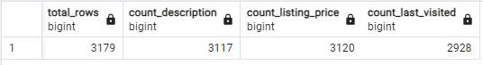

-----------------------------------
## 2. Nike vs Adidas pricing

```
select b.brand ,f.listing_price::int ,count(f.*)  
from brands as b
inner join finance as f
on b.product_id=f.product_id
where b.brand ='Adidas' or b.brand ='Nike' and f.listing_price>0
group by b.brand,f.listing_price
order by f.listing_price desc

```
------------------------
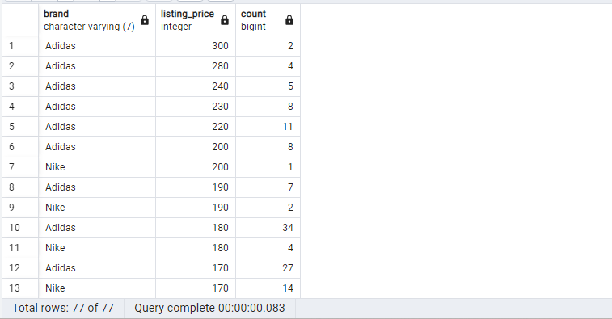
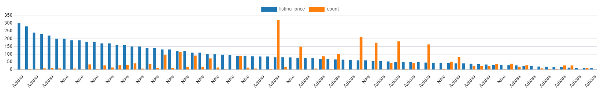
------------------------
## 3. Labeling price ranges

```
select b.brand ,count(f.*), sum(f.revenue) as total_revenue,
case 
when f.listing_price < 42 then 'Budget'
when f.listing_price >= 42 and f.listing_price<74 then 'Average'
when f.listing_price>=74 and f.listing_price<129 then 'Expensive'
when f.listing_price>=129 then 'Elite'
end as price_category
from brands as b
left join finance as f 
on b.product_id=f.product_id
where brand is not null 
group by b.brand , price_category
order by total_revenue desc
```
---------------
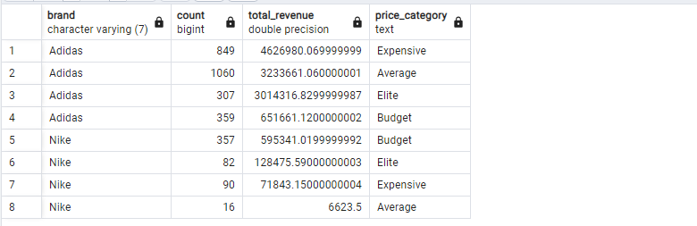

------------------------
## 4. Average discount by brand
```
select b.brand , avg(f.discount)*100 as average_discount 
from brands as b 
inner join finance as f
on b.product_id = f.product_id
where b.brand is not null
group by b.brand
```
------------------------
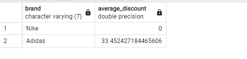

---------------------------
## 5. Correlation between revenue and reviews
```
-- Calculate the correlation between reviews and revenue as review_revenue_corr
-- Join the reviews and finance tables on product_id
select corr(r.reviews,f.revenue)as review_revenue_corr
from reviews as r 
left join finance as f
on r.product_id= f.product_id
```
----------------------
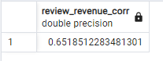
--------------------------
## 6. Ratings and reviews by product description length
```
select (length(i.description)-length(i.description )%100)as description_length, round(avg(r.rating::numeric),2)as average_rating
from info as i
left join reviews as r
on i.product_id= r.product_id
where i.description is not null
group by description_length
order by description_length
```
------------------
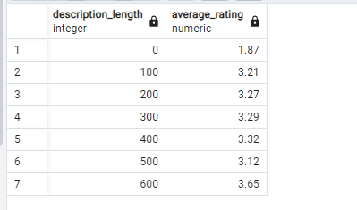
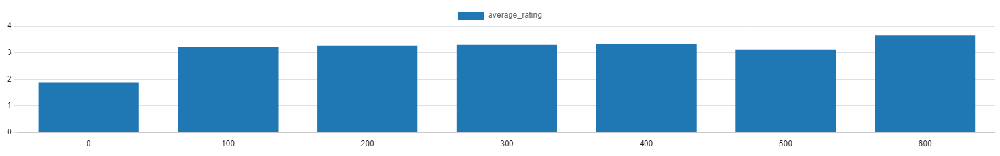
---------------------------
## 7. Reviews by month and brand
```
select b.brand, extract(month from t.last_visited)as month , count(r.product_id) as num_reviews
from traffic as t
inner join reviews as r
on t.product_id= r.product_id
inner join brands as b
on t.product_id = b.product_id
where extract(month from t.last_visited) is not null and b.brand is not null
group by b.brand,month
order by b.brand,month
```
----------------------------
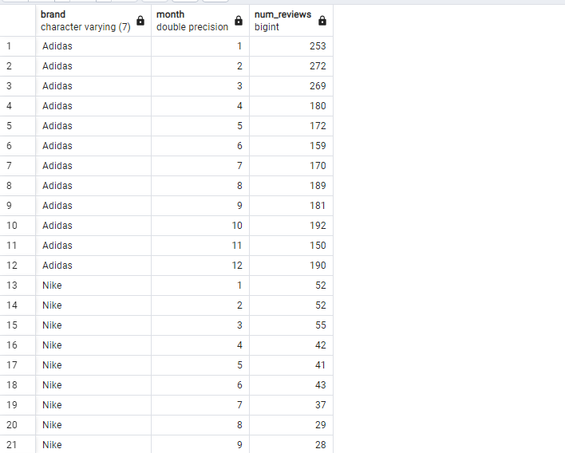
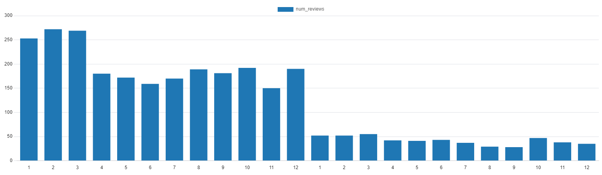

------------------------------------
## 8. Footwear product performance
```

-- Calculate the number of products and median revenue for footwear products
with footwear as(
    select i.description as description , f.revenue as revenue
    from info as i
    inner join finance as f
    on i.product_id=f.product_id
    where i.description ilike '%shoe%' or i.description ilike '%trainer%' or i.description ilike '%foot%'
)
select count(*)as num_footwear_products,PERCENTILE_disc(.5)
within group (order BY revenue) as median_footwear_revenue
from footwear

```
-----------------------------
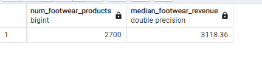

------------------------------------
## 9. Clothing product performance
```

with footwear as(
    select i.description as description , f.revenue as revenue
    from info as i
    inner join finance as f
    on i.product_id=f.product_id
    where i.description ilike '%shoe%' or i.description ilike '%trainer%' or i.description ilike '%foot%'
)
select count(i.*) as num_clothing_products, percentile_disc(.5) within group(order by(f.revenue))as median_clothing_revenue
from info as i
inner join finance as f 
on i.product_id=f.product_id
where i.description not in (select description from footwear)
```
-----------------------------

-------------------------------
### THANK YOU♥